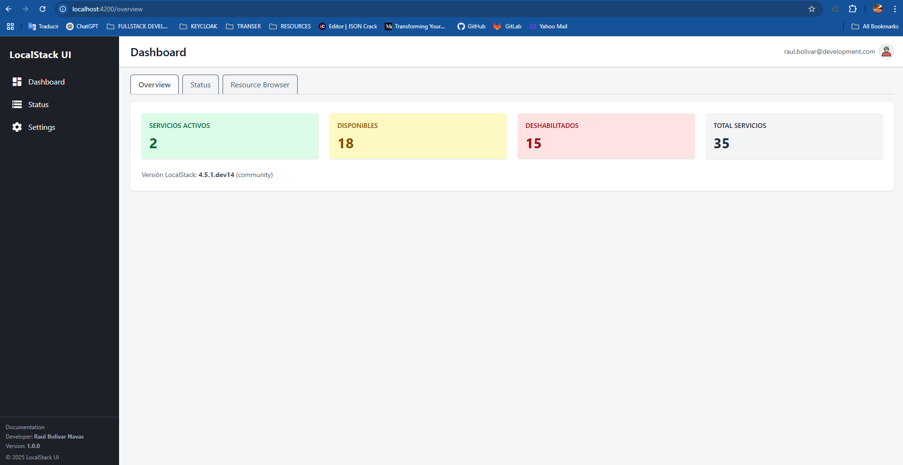
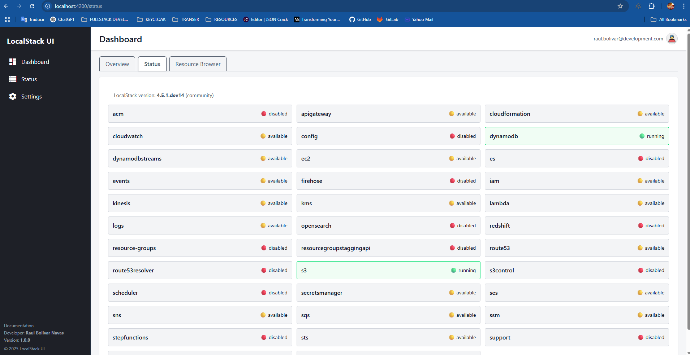
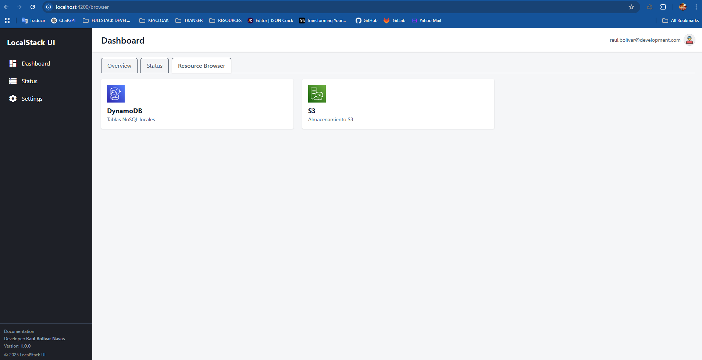

<p align="center">
  
</p>

LocalStack is a cloud software development framework to develop and test your AWS applications locally.

## How to run the project

1. **Clone the repository**:
   ```bash
   git clone https://github.com/raulrobinson/dashboard-localstack-tailwindcss
   ```

2. **Navigate to the project directory**:
   ```bash
    cd dashboard-localstack-tailwindcss
    ```
   
3. **Install LocalStack infrastructure** (if not already installed):
   ```bash
   docker-compose up -d
   ``` 
   
4. **Install dependencies**:
   ```bash
   npm install --force
   ```
   
5. **Start the Localstack service**:
   ```bash
   ng serve
   ```
   
### Dashboard Preview



### Status of Localstack services



### Resource Browser



### DynamoDB 


## Development server

Run `ng serve` for a dev server. Navigate to `http://localhost:4200/`. The application will automatically reload if you change any of the source files.

## Code scaffolding

Run `ng generate component component-name` to generate a new component. You can also use `ng generate directive|pipe|service|class|guard|interface|enum|module`.

## Build

Run `ng build` to build the project. The build artifacts will be stored in the `dist/` directory.

## Running unit tests

Run `ng test` to execute the unit tests via [Karma](https://karma-runner.github.io).

## Running end-to-end tests

Run `ng e2e` to execute the end-to-end tests via a platform of your choice. To use this command, you need to first add a package that implements end-to-end testing capabilities.

## Further help

To get more help on the Angular CLI use `ng help` or go check out the [Angular CLI Overview and Command Reference](https://angular.io/cli) page.
